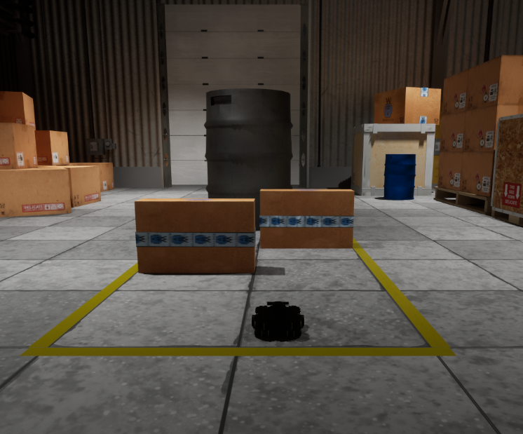

# A* Path Planning on TurtleBot3 with FalconSim & ROS2

Welcome to **Project 03 - Phase 2** of ENPM661 Spring 2025. In this assignment, you will implement the A* algorithm for a differential-drive robot and simulate the results in a realistic warehouse environment using **FalconSim** and ROS2.

---



---

## 📁 Project Structure (after setup)

To reduce repository size, the `Scenarios/` folder is hosted externally.

Follow these steps to set up your local directory correctly:

1. Create a folder named `Scenarios/` at the same level as your `ROS2/` and `Twins/` folders in the project directory.
2. Download the AMRPathPlanning scenario from Falcon Cloud (login required using your Falcon EDU credentials):  
   📥 [Download Here](https://falcon.duality.ai/secure/scenarios/edit/a265f262-d751-452f-83f6-9713ef4f9c10)
3. Unzip the downloaded folder.
4. Place the unzipped `AMRPathPlanning` folder inside your `Scenarios/` folder.

Your final folder structure should look like this:

```text
AStarPlanningProject/
├── ROS2/
│   └── falcon_turtlebot3_project_ws/
├── Scenarios/
│   └── AMRPathPlanning/
│       ├── AMRPathPlanning.usda
│       ├── AMRPathPlanning.py
│       └── Paks/
│           └── <*.pak file>
├── Twins/
│   └── (Environment + TurtleBot Twin files)
├── slides/
└── README.md
```

### Notes

- `AMRPathPlanning.py` controls the FalconSim-side robot behavior and interprets velocity commands from ROS2.
- `Paks/` contains the environment assets required by FalconSim to render and simulate the warehouse environment.
- This setup step is **required for both VM and local users** to run the simulation correctly.

---

### Directory Descriptions

- `ROS2/`: Contains the ROS2 workspace with launch files and source code
- `Scenarios/AMRPathPlanning/`: FalconSim USD scenario, Paks folder, and Python control script
- `Twins/`: Simulation-related configuration for both the environment and the TurtleBot3 hero twin
- `slides/`: PDF slides provided for classroom instruction

---

## 🛠️ Requirements (Local Users)

| System Requirement | Minimum Spec            |
|--------------------|-------------------------|
| OS                 | Ubuntu 22.04            |
| GPU                | Nvidia GeForce 3050     |
| RAM                | 16 GB                   |

**Software Dependencies**:
- FalconSim 5.1 (Linux only)
- ROS2 Humble
- Colcon
- Falcon Account

---

## 📦 Installation & Setup

### 1. Falcon Setup
- [Create a Falcon Account](https://falcon.duality.ai/auth/sign-up)
- [Download FalconSim for Ubuntu 5.1](https://falcon.duality.ai/secure/downloads)
```bash
cd ~/Downloads
sudo apt install ./FalconSim_Linux_Ubuntu22_v5.1.0216.deb
```

### 2. Install ROS2 Humble (If not already installed)
Follow [this guide](https://docs.ros.org/en/humble/Installation.html)
Then install colcon:
```bash
sudo apt install python3-colcon-common-extensions
```

### 3. Run FalconSim Once
```bash
cd ~/duality/falconsim/
./Falcon.sh
```
- Login and save credentials when prompted, then close FalconSim. (No need to use the UI to load scenario)

### 4. Clone This Repo & Setup ROS2 Workspace
```bash
git clone https://github.com/your-username/AStarPlanningProject.git
cd AStarPlanningProject/ROS2/falcon_turtlebot3_project_ws
source /opt/ros/humble/setup.bash
colcon build
source install/setup.bash
```

### 5. Update Launch File Paths
location: ROS2/falcon_turtlebot3_project_ws/src/astar_falcon_planner/launch/ros_falcon_astar.launch.py 
```bash
ros_falcon_astar.launch.py
```
Edit ros_falcon_astar.launch.py:
- Update `cwd=` to your FalconSim install path (e.g., /home/username/duality/falconsim/)
- Update `scenario=` to the full path of `AMRPathPlanning.usda`

### 6. Launch Simulation
Use the command below to launch your simulation.

> **Note:** All values must be filled in by you based on your planning map and robot configuration. These are intentionally left as `0.0` to prompt calculation and testing.

```bash
ros2 launch astar_falcon_planner ros_falcon_astar.launch.py \
    start_position:=[0.0, 0.0, 0.0] \
    end_position:=[0.0, 0.0, 0.0] \
    robot_radius:=0.0 \
    clearance:=0.0 \
    delta_time:=0.0 \
    wheel_radius:=0.0 \
    wheel_distance:=0.0 \
    rpms:=[0.0, 0.0]
```

## Important Notes
- Set start pose in `Scenarios/AMRPathPlanning/AMRPathPlanning.usda` (around line 50)
- FalconSim uses centimeters (cm); ROS2 operates in meters (m) — the conversion is handled automatically in `AMRPathPlanning.py`
- Ensure your grid map is defined in centimeters (cm) for better path resolution.
- You will implement A* in: `astar_falcon_planner/submodules/astar_planner.py`

## Learn About the Simulation Environment
[Falcon Docs & Videos (EDU login required)](https://falcon.duality.ai/secure/documentation/umd-enpm-661-astar-planning-project-videos)
This page includes:
- FalconSim onboarding for students
- Demo videos of scenario setup and outputs
- Sample commands and map guidance


## Deliverables

Your team must submit a `.zip` file named: proj3p2_firstname#1_firstname#2_firstname#3.zip
This ZIP should contain the following **folders and files**:

```bash
proj3p2_firstname#1_firstname#2_firstname#3.zip
├── Part01/
│   └── Source Code (.py)
├── Part02/
│   └── ROS2 Workspace (modified with your A* implementation)
└── README.md or README.txt
```

The `README` must include:
- Clear instructions to **run Part01 and launch Part02 (ROS2 Node)**
- Example input parameters for terminal execution
- List of dependencies used (e.g., numpy, matplotlib, etc.)
- Names of all team members with their **Directory ID and UID**
- GitHub repository link to the project  
  - Should contain **at least 5 commits** (combined, across all members)
  - Initially set to **Private**, and change to **Public** after the deadline
- **Do NOT** upload `Scenarios` and `Twins` folders — only include the `ROS2/` folder

---

### Simulation Videos

Upload **2 videos** (Do not include `.mp4` in the ZIP):

- **Part 01**: Python path planner moving past 2 rectangles and the circle
- **Part 02**: TurtleBot3 navigating in FalconSim from a Start point to a Goal point.

Upload the videos to **Google Drive** or **YouTube (Unlisted)**  
Include the links in your `README.md`

---

### Additional PDF Submission

**Also submit:** proj3p2_firstname#1_firstname#2_firstname#3.pdf

This must contain the **complete source code for both Part01 and Part02**.  
Do **not** include this file inside the ZIP — submit it separately for plagiarism check.


## Final Checklist

1. Follow setup instructions for FalconSim & ROS2
2. Update launch file paths and uderstand the package structure
3. Successfully launch the scenario with a valid A* implementation of your own
4. Submit all deliverables correctly and on time

## Learning Outcomes
- Implement the A* path planning algorithm from scratch
- Integrate and control a robot in a realistic digital twin environment using ROS2
- Learn how to tune parameters for non-holonomic robot navigation
- Gain experience configuring and launching simulations using FalconSim

## Need Help?
For FalconSim setup or debugging questions, reach out to us on our [Community Discord](https://discord.com/invite/dualityfalconcommunity). 

Good luck and happy path planning!
